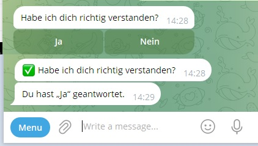
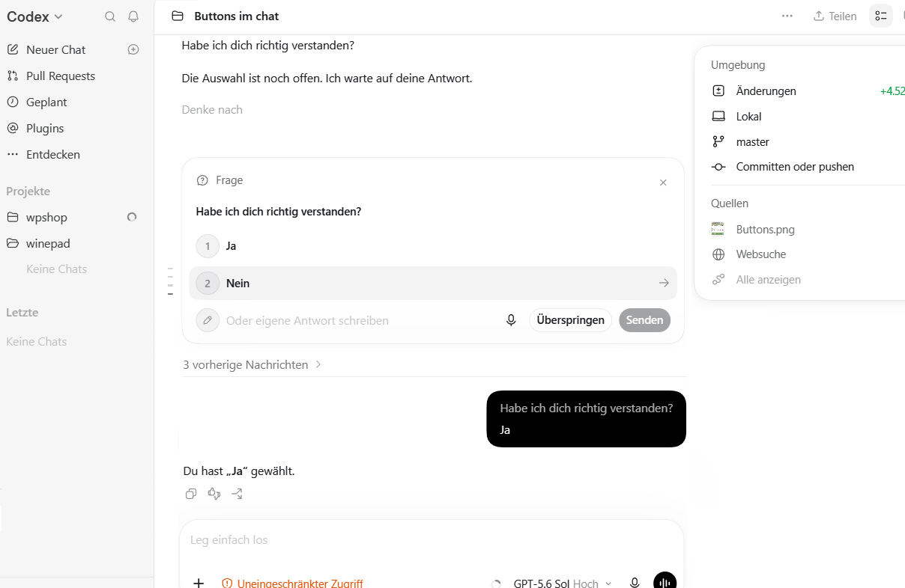

# Кнопки для AI-агентов

[English version](readme.md) · **Русская версия** · [Deutsche Version](readme_de.md)

Кнопки удобны для коротких, явных и исчерпывающих вариантов ответа. Они уменьшают неоднозначность, исключают опечатки и связывают выбранный вариант с конкретным действием.

## Telegram

[Инструкция и готовый промпт для Telegram](buttons_ru.md)

В Telegram кнопки прикрепляются к сообщению и возвращают однозначный callback. Отдельно описаны подтверждения действий и нейтральные варианты выбора.

## Codex

[Инструкция и готовый промпт для Codex](codex_buttons_ru.md)

В Codex варианты показываются через встроенный запрос пользовательского ввода. Инструкция объясняет, как включить этот шаблон на уровне пользовательской конфигурации.
